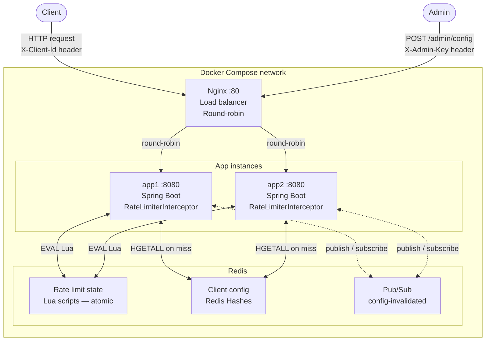

# RateMesh

A distributed rate limiting service built with Spring Boot and Redis. RateMesh enforces per-client request limits across multiple application instances using atomic Redis Lua scripts, ensuring correctness without race conditions regardless of which instance handles a request.

Load tested at **2,330 RPS** through an Nginx load balancer with two application instances sharing Redis state.

---

## Architecture



### Component responsibilities

**Nginx** — Round-robin load balancer. Distributes incoming requests across app instances. Client never communicates directly with an app instance.

**App instances (app1, app2)** — Each runs the full Spring Boot application. A `RateLimiterInterceptor` intercepts every request, looks up the client's rate limiter, and either allows or rejects the request. Client configuration is cached locally in a `ConcurrentHashMap` for fast reads. Rate limit state (token counts, timestamps) always lives in Redis — never in local memory.

**Redis** — Shared state store. Two responsibilities: (1) source of truth for client configuration via Redis Hashes, (2) rate limit state enforced atomically via Lua scripts. Also runs a Pub/Sub channel (`config-invalidated`) so that when one instance registers or deregisters a client, all other instances evict their local cache and re-hydrate from Redis.

### Why shared Redis state is required

Each app instance has independent JVM memory. Without Redis, app1 and app2 would each maintain their own counters — a client with a limit of 5 could make 5 requests to app1 and 5 requests to app2, allowing 10 total. Redis is the single shared counter store that makes distributed enforcement correct.

---

## Algorithms

RateMesh supports two rate limiting algorithms, selectable per client at registration time.

### Token Bucket

Each client has a bucket with a maximum capacity of tokens. Every request consumes one token. Tokens refill continuously at a configured rate. If the bucket is empty, the request is rejected.

**Allows bursting** — a client that hasn't made requests for a while accumulates tokens up to capacity and can use them all at once.

**Best for:** APIs where short bursts are acceptable but sustained throughput must be limited. Example: a search API that allows 10 requests in a burst but no more than 2/sec sustained.

### Sliding Window Log

Maintains a log of timestamps of recent requests in a Redis Sorted Set. On each request, timestamps outside the window are removed, then the count of remaining timestamps is checked against the limit. If under the limit, the request is allowed and its timestamp is recorded.

**No bursting** — the limit is enforced uniformly across any rolling window of time.

**Best for:** APIs that need strict, even enforcement with no burst allowance. Example: a payment API that must never exceed 100 requests per minute regardless of timing.

### Comparison

| Property               | Token Bucket          | Sliding Window Log                   |
| ---------------------- | --------------------- | ------------------------------------ |
| Burst allowed          | Yes                   | No                                   |
| Memory per client      | O(1) — two Redis keys | O(n) — one key per request in window |
| Clock skew sensitivity | Low                   | Medium                               |
| Best for               | General APIs          | Strict enforcement                   |

### Why Lua scripts for enforcement

Redis `MULTI/EXEC` transactions cannot perform conditional branching — you cannot read a value and then make a decision inside a transaction. This means a check-then-act sequence (read tokens → decide → update tokens) has a race window between the read and the write.

Lua scripts execute atomically inside Redis's single-threaded event loop. The entire script — read, decide, write — runs without any other command executing in between. This is the only correct way to implement rate limiting in Redis without race conditions.

---

## How to Run

### Prerequisites

- Docker and Docker Compose installed

### Start the full stack

```bash
git clone https://github.com/Trinabh007/rate-limiter.git
cd rate-limiter
docker compose up --build
```

This starts four containers: Redis, two Spring Boot app instances, and Nginx. The application is accessible at `http://localhost`.

### Register a client

```bash
curl -X POST http://localhost/admin/config \
  -H "Content-Type: application/json" \
  -H "X-Admin-Key: secret123" \
  -d '{
    "clientId": "my-client",
    "algorithm": "TOKEN_BUCKET",
    "maxRequests": 10,
    "refillRate": 2
  }'
```

### Make requests

```bash
curl -H "X-Client-Id: my-client" http://localhost/api/resource
```

### Deregister a client

```bash
curl -X DELETE http://localhost/admin/config/my-client \
  -H "X-Admin-Key: secret123"
```

### Health check

```bash
curl http://localhost/actuator/health
```

### Stop

```bash
docker compose down
```

---

## API Reference

### POST /admin/config

Register a new client with a rate limit configuration.

**Headers**

- `X-Admin-Key` — admin authentication key
- `Content-Type: application/json`

**Body**

| Field              | Type   | Description                                                                |
| ------------------ | ------ | -------------------------------------------------------------------------- |
| clientId           | string | Unique client identifier                                                   |
| algorithm          | string | `TOKEN_BUCKET` or `SLIDING_WINDOW_LOG`                                     |
| maxRequests        | int    | Max requests allowed (capacity for token bucket, limit for sliding window) |
| refillRate         | double | Tokens per second (token bucket only)                                      |
| windowSizeInMillis | long   | Window size in ms (sliding window only)                                    |

**Responses**

- `200 OK` — Client registered successfully
- `401 Unauthorized` — Invalid or missing admin key

---

### DELETE /admin/config/{clientId}

Deregister a client. Broadcasts cache invalidation to all instances via Redis Pub/Sub.

**Headers**

- `X-Admin-Key` — admin authentication key

**Responses**

- `200 OK` — Client deregistered
- `404 Not Found` — Client does not exist
- `401 Unauthorized` — Invalid or missing admin key

---

### GET /api/resource

A sample protected endpoint. Any endpoint behind the `RateLimiterInterceptor` behaves identically.

**Headers**

- `X-Client-Id` — registered client identifier

**Responses**

- `200 OK` — Request allowed
- `429 Too Many Requests` — Rate limit exceeded, includes `Retry-After` header
- `404 Not Found` — Unknown client

---

## Design Decisions

### Fail-open on Redis unavailability

If Redis is unreachable, RateMesh allows requests through rather than rejecting them. This is a deliberate tradeoff: availability over strict enforcement. In a payment or security context you would fail closed. For a general API gateway, dropping all traffic because the rate limiter is down is worse than briefly allowing unlimited traffic.

This decision is documented here so it can be changed per deployment requirements.

### RDB persistence over AOF

Redis is configured with RDB snapshot persistence (`--save 60 1`). Rate limit state is ephemeral by design — keys have TTLs and a few lost counts on restart are acceptable. Client configuration has an external source of truth (the admin API), so it can be re-registered after a restart. Neither dataset needs the near-zero data loss guarantee of AOF, and RDB offers faster restart times.

### Local cache with Redis as source of truth

Client configuration is read on every request but written rarely (only on admin registration). Fetching from Redis on every request would add a network round trip for a read-heavy, write-rarely workload. Instead, each instance caches config locally and uses Redis Pub/Sub to invalidate that cache when config changes. Rate limit _state_ (token counts, timestamps) always lives in Redis — it cannot be cached locally because it must be consistent across instances.

### Redis remains a single point of failure

Redis is not clustered in this setup. Redis Sentinel or Redis Cluster would eliminate this SPOF. This is a known limitation documented as a future improvement.

---

## Load Test Results

Tested with `wrk` — 8 threads, 200 concurrent connections, 30 seconds.

```
wrk -t8 -c200 -d30s -H "X-Client-Id: loadtest" http://localhost/api/resource

Running 30s test @ http://localhost/api/resource
  8 threads and 200 connections
  Thread Stats   Avg      Stdev     Max   +/- Stdev
    Latency    98.96ms   95.23ms   1.14s    91.56%
    Req/Sec   296.15    161.64     1.17k    75.82%
  70146 requests in 30.10s, 12.71MB read
Requests/sec:  2330.40
Transfer/sec:   432.40KB
```

**2,330 RPS** sustained through Nginx → two Spring Boot instances → Redis Lua scripts, running entirely in Docker Compose on a single machine. On dedicated hardware with a proper network, throughput would be significantly higher.

---

## Tech Stack

| Component        | Technology                     |
| ---------------- | ------------------------------ |
| Application      | Java 25, Spring Boot 4.1       |
| Rate limit state | Redis 7 (Lua scripts)          |
| Load balancer    | Nginx                          |
| Containerization | Docker, Docker Compose         |
| Redis client     | Lettuce (Spring Data Redis)    |
| API docs         | SpringDoc OpenAPI (Swagger UI) |
| Health checks    | Spring Boot Actuator           |
